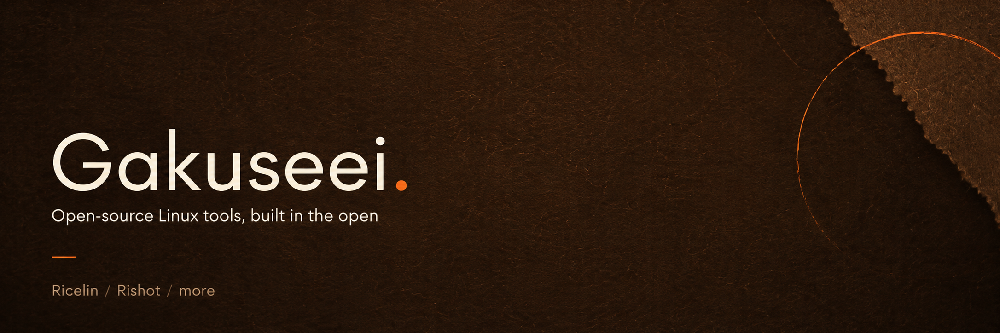

I build Linux desktop stuff, mostly Rust and QML, driven by whatever annoys me enough on my own setup. Everything local-first, everything on Arch/CachyOS, most of it because I wanted it myself.

### Things I made

| Project | What it is | |
|---|---|---|
| [Ricelin](https://github.com/Gakuseei/Ricelin) | Hand-written Quickshell rice, one pill that morphs into everything |  |
| [rishot](https://github.com/Gakuseei/rishot) | Wayland screenshot and annotation overlay |  |
| [Aria](https://github.com/Gakuseei/Aria) | Fully offline AI companion, custom characters, 13 languages |  |

### Tools I reach for

If something here saved you time: [ko-fi.com/gakuseei](https://ko-fi.com/gakuseei)
